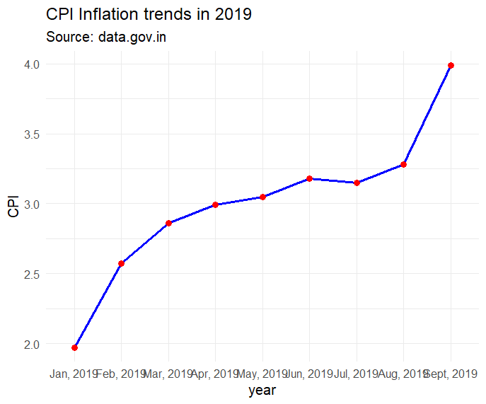

## CPI inflation trend analysis- India 2019
## What I explored- How the CPI changed every month in 2019 in India
#Key findings- CPI was at its lowest in Jan of 2019 
- showed a steady upward trend through the mid of the year
- became constant around June to July at 3.15 to 3.18
- spiked sharply from September- nearly double of January's value
- overall inflation doubled over the year

  ## 

## Data Source
Government of India — [data.gov.in](https://data.gov.in)

## Tools Used
- R
- ggplot2
- dplyr
- readxl

## How to Run
1. Download CPI_2019.R and the dataset
2. Open in RStudio
3. Run the script
